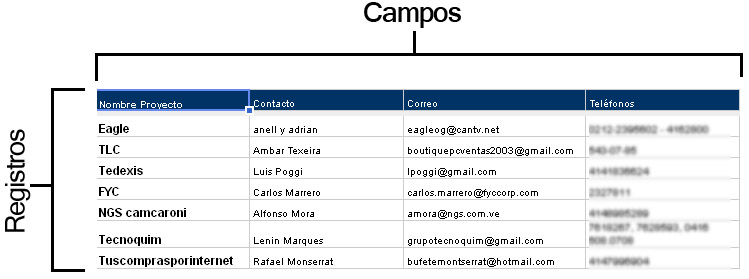

## ¿Qué aprendimos la clase pasada?

* Utilizar R como calculadora.
* Asignar objetos a variables para poder utilizarlos después
* Evaluar funciones.
* Utilizar scripts como archivos de texto donde apuntamos nuestro código.
* Atajos para correr scripts en lugar de copiar y pegar el código en la consola.

En esta clase utilizaremos un paquete de R para manipulación de tablas de datos
(__data frames__).

## Conceptos preliminares:

### Operadores relacionales

Sirven para comparar dos cantidades. Regresan __TRUE__ si la comparación es
cierta y __FALSE__ en otro caso.

Ejemplos:

```{r}
5 == 5 # Notar que se pone doble igualdad para comparar dos cantidades
5 > 6
5 < 6
6 >= 3
6 <= 3.4

# Otro operador muy útil para ver si un elemento se encuentra en un vector
c(1, 2, 3) # Formando un vector que contiene los números 1, 2, 3
5 %in% c(1, 2, 3)
2 %in% c(1, 2, 3)
```

### Operadores booleanos

Sirven para comparar dos expresiones como las anteriores:

El operador __y__ (&) regresa verdadero si las dos expresiones que recibe son
verdaderas y falso en otro caso.

```{r}
(5 > 6) & (7 < 8) # Y: notar que regresa false porque 5 > 6 es falso
(5 < 6) & (7 < 8)
(5 > 6) & (7 > 8)
```

El operador __o__ (|) regresa verdadero si __alguna__ de las expresiones que
recibe es verdadera y falso en otro caso.

```{r}
(5 > 6) | (7 < 8) # O: notar que regresa true conque alguna de las expresiones sea verdadera
(5 < 6) | (7 < 8)
(5 > 6) | (7 > 8)
```

El operador lógico __no__ (! regresa verdadero si la expresión que recibe es
falsa y viceversa)

```{r}
5 > 6
!(5 > 6)
```

 Evalúa una a una las siguientes expresiones y
explica por qué da TRUE o FALSE. Sugerencia: compréndelas una a una y en orden.

```{r, eval=FALSE}
5 < 7
!(5 < 7)
5 > 6
6 <= 6
6 >= 6
!(5 < 7) & (5 > 6)
(!(5 < 7) & (5 > 6)) | (6 <= 6)
!(5 < 7) & ((5 > 6) | (6 <= 6))
```

## El paquete dplyr (instalado con el tidyverse)

```{r, message==FALSE}
# Cargando el paquete
library("tidyverse")
```

Un data frame se compone de __registros__ (renglones) y __campos o variables__ (columnas):



Con **dplyr** se podrán realizar acciones muy útiles como las siguientes:

1. **Seleccionar** campos de un data frame
2. **Filtrar** registros de un data frame que cumplan cierta condición.
3. **Ordenar** registros de acurdo a su valor en ciertos campos.
4. **Crear** nuevas columnas a partir de los valores de las preexistentes
5. **Calcular resúmenes** de **agregados** de datos (como las tablas dinámicas en
Excel).
6. **Unir tablas** de acuerdo a sus valores en ciertos campos (se verá más adelante).

### 1. Seleccionar campos de un data frame: select(df, columnas_a_seleccionar)

```{r}
# Usaremos el data frame diamonds cargado con "tidyverse"
glimpse(diamonds)
# View(diamonds) # Para ver el data frame en formato de Excel.

diamonds_columnas_selectas <- select(diamonds, carat, cut)
diamonds_columnas_selectas

# Otras maneras de seleccionar columnas:
select(diamonds, starts_with("c"))
select(diamonds, contains("able"))
select(diamonds, -carat, -cut, -color)
```

 Crea un data frame nuevo a partir de diamonds con
las columnas carat, x, y, z únicamente.

### 2. Filtrar registros de un data frame que cumplen cierta condición: filter(df, condiciones)

```{r}
diamonds_registros_selectos <- filter(diamonds, cut == "Ideal", x > 4)
diamonds_registros_selectos

# Otras maneras de filtrar registros
filter(diamonds, cut == "Ideal" & x > 4)
filter(diamonds, cut == "Ideal" | x > 4)

```

 Crea un data frame nuevo a partir de diamonds
que contenga los registros que cumplen la condición: '__alguna__ de x, y, z  es mayor a 3.5'

### 3. Ordenar registros de un data frame por los valores en una o más variables: arrange(df, variables_de_ordenamiento)

```{r}
diamonds_ordenado <- arrange(diamonds, carat, depth)
diamonds_ordenado
# desc(variable): ordena en sentido decreciente (Z-A), (mayor a menor, etc)
arrange(diamonds, carat, desc(depth))
arrange(diamonds, desc(carat), depth)
```

 Crea un data frame nuevo a partir de diamonds
que contenga los registros organizados alfabéticamente por "color"", y por "carat"
de manera descendente.

### 4. Crear nuevas variables: mutate(df, formulas)

```{r}
diamonds_nueva_variable <- mutate(diamonds, dollars_per_carat = price / carat)
```

 Crea un data frame nuevo a partir de diamonds
que contenga la variable "dollars_per_carat" anterior, y la variable "product"
calculada comos x \times y \times z.

### 5. Agrupar por ciertas variables: group_by(data_frame, variables) y crear resúmenes por grupo: summarise(data_frame, formulas)

* Para crear resúmenes de un data frame se utiliza la función __summarise__.
* Si se agrupan los datos antes (utilizando la función __group_by__), se pueden crear
resúmenes por nivel de las variables de agregación (definidas en el group_by).
Esto es análogo a las tablas dinámicas en Excel.

```{r}
# Calcular el promedio de depth y la mediana de price y asignarlos a las
# variables "promedio_depth" y "mediana_price"
diamonds_resumen <- summarise(diamonds, promedio_depth = mean(depth), mediana_price = median(price))
diamonds_resumen

# Calcular el promedio de depth y la mediana de price y asignarlos a las variables
# "promedio_depth" y "mediana_price", por nivel de "cut"
# Primero agrupo por la variable de interés
diamonds_agrupado <- group_by(diamonds, cut)
diamonds_agrupado

# Y calculo resúmenes para cada nivel de dicha variable
diamonds_resumen_por_grupo <- summarise(diamonds_agrupado, promedio_depth = mean(depth), mediana_price = median(price))
diamonds_resumen_por_grupo
```

Algunos resúmenes útiles con _summarise_ son:

* El mínimo de un campo x: __min(x)__
* La mediana de un campo x: __median(x)__
* El máximo de un campo x: __max(x)__
* El número de registros: __n()__
* La suma de un campo x: __sum(x)__
* La desviación estándar de un campo x: d(x).

 Crea un data frame nuevo a partir de diamonds
que contenga el número de registros para cada combinación de valores en las variables
"cut" y "color".

 Explica las diferencias que notas entre los data
frames obtenidos de:
```{r, eval=FALSE}
diamonds_agrupado <- group_by(diamonds, cut)
resultado_1 <- summarise(diamonds_agrupado, promedio_depth = mean(depth))
resultado_2 <- mutate(diamonds_agrupado, promedio_depth = mean(depth))
```

 Partiendo del data frame diamonds, crea un
data frame nuevo con las siguientes características:

1. Contenga la variable dollars_per_carat = price / carat

2. Contenga sólo aquellos registros que cumplen dollars_per_carat < 4000

3. Esté ordenado en orden descendente por la variable dollars_per_carat

### El operador pipeline %>%

El ejemplo anterior nos introduce a lo tedioso que es aplicar varias funciones
para transformar datos una tras otra sin ayuda. Aquí es cuando el operador
pipeline entra en acción:

Nos permite encadenar operaciones de manera sencilla, comenzando por el data frame
original (diamonds), luego aplicar una transformación, al resultado aplicar otra
y así sucesivamente.

Por ejemplo:

```{r}
# Calcular el mínimo de x, y el máximo de y por combinación de cut y color
# y al resultado ordenarlo por color de manera descendente.
diamonds_procesado <- diamonds %>%
  # Primero agrupo por combinación de cut y color, ya que lo necesito para calcular
  # los resúmenes por grupo
  group_by(cut, color) %>%
  # Luego calculo los resúmenes por grupo
  summarise(minimo_x = min(x), maximo_y = max(y)) %>%
  # Finalmente ordeno por color
  arrange(desc(color))
diamonds_procesado
View(diamonds_procesado)
```

El pipeline __%>%__ se puede leer intuitivamente como "después"

 Tarea: transforma el código de todos los ejemplos
de la sección 5 para incorporar el uso del pipeline.


